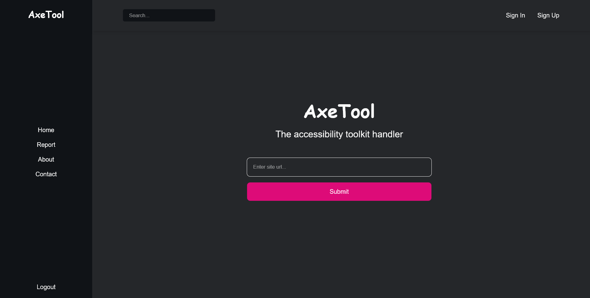
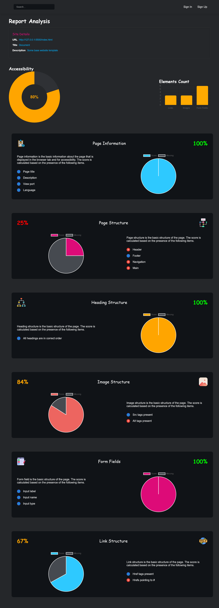

# Accessibility Toolkit

This is a (soon to be) AI owered accessibility toolkit for websites. Be able to determine how accessible your website is and receive recommendations on how to imrove it for better equality and accessibility.

## Getting started

To get started with this code:

Clone this repository and `cd` into it:

```sh
git clone https://github.com/hassanShakur/accessibility-toolkit.git

cd accessibility-toolkit
```

Change directory into the `server` folder and install the dependencies:

```sh
cd server

npm install
```

Also install python dependencies in the same folder:

```sh
pip install -r requirements.txt
```

Change directory into the `client` folder and install the dependencies:

```sh
cd client

npm install
```

## Running the code

To run the code, you need to start the server and the client. To start the server, run:

```sh
cd server

npm run dev
```

To start the client, run:

```sh
cd client

npm run dev
```

## Sample UI View

### Home Page



<br>
<br>

### Sample accessibility report



**Note:** This is a work in progress. More features will be added soon, including a better UI and more accessibility checks.
